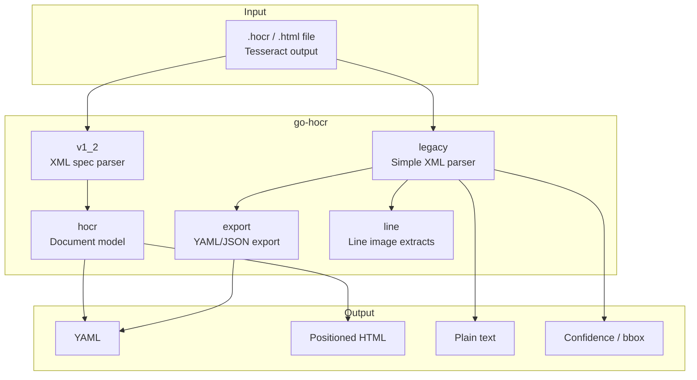

# go-hocr

[](https://pkg.go.dev/github.com/eslider/go-hocr)
[](https://www.gnu.org/licenses/gpl-3.0)
[](https://go.dev)
[](https://github.com/eSlider/go-hocr/releases)
[](https://github.com/eSlider/go-hocr/stargazers)

Go library for parsing, analysing, and exporting [hOCR](https://en.wikipedia.org/wiki/HOCR) files — the HTML-based OCR output format used by [Tesseract](https://github.com/tesseract-ocr/tesseract) and other OCR engines.

Extracted from [vidarr](https://git.produktor.io/produktor/vidarr) as a standalone library.

## Architecture



## Packages

| Package | Import | Description |
|---|---|---|
| `hocr` | `github.com/eslider/go-hocr` | hOCR 1.2 document model with YAML/HTML export |
| `v1_2` | `github.com/eslider/go-hocr/v1_2` | Low-level hOCR 1.2 XML types and property parsing |
| `legacy` | `github.com/eslider/go-hocr/legacy` | Lightweight parser for Tesseract hOCR (text, confidence, bbox) |
| `export` | `github.com/eslider/go-hocr/export` | Flatten legacy documents for JSON/YAML serialization |
| `line` | `github.com/eslider/go-hocr/line` | OCR line details with optional image crops |

---

## Installation

```bash
go get github.com/eslider/go-hocr
```

**System dependency** (to produce hOCR files):

```bash
# Debian/Ubuntu
sudo apt-get install tesseract-ocr tesseract-ocr-deu tesseract-ocr-eng
```

Generate hOCR with Tesseract:

```bash
tesseract input.png output -l deu --oem 3 --dpi 600 --psm 1 hocr
# produces output.hocr
```

---

## Quick Start

### 1. Parse hOCR 1.2 document (structured API)

```go
import hocr "github.com/eslider/go-hocr"

doc, err := hocr.ReadFile("invoice.hocr")
if err != nil {
    log.Fatal(err)
}

fmt.Println("OCR system:", doc.System)
fmt.Println("Capabilities:", doc.Capabilities)

yaml, _ := doc.ToYaml()
fmt.Println(yaml)

html, _ := doc.ToHtml(1) // page 1
fmt.Println(html)
```

### 2. Extract plain text and confidence (legacy API)

```go
import "github.com/eslider/go-hocr/legacy"

text, err := legacy.GetText("invoice.hocr")
avgConf, err := legacy.GetAvgConf("invoice.hocr")
wordConfs, err := legacy.GetWordConfs("invoice.hocr")
```

### 3. Export to YAML/JSON

```go
import (
    "github.com/eslider/go-hocr/export"
    "github.com/eslider/go-hocr/legacy"
    "gopkg.in/yaml.v3"
)

data, _ := os.ReadFile("invoice.hocr")
h, _ := legacy.Parse(data)

doc, _ := export.NewDocument(h, false, false)
out, _ := yaml.Marshal(doc)
fmt.Println(string(out))
```

### 4. Line details with image crops

```go
import "github.com/eslider/go-hocr/legacy"

lines, err := legacy.GetLineDetails("invoice.hocr")
for _, ln := range lines {
    fmt.Printf("%s (conf=%.2f): %s\n", ln.Name, ln.Avgconf, ln.Text)
}
```

---

## API Reference

### `hocr` — Document model

| Function / Method | Description |
|---|---|
| `ReadFile(path)` | Parse an hOCR file into a structured `Document` |
| `NewDocument(*v1_2.Document)` | Build document from raw spec types |
| `(*Document) ToYaml()` | Export document as YAML string |
| `(*Document) ToHtml(pageNr)` | Export positioned HTML for a page |
| `(*Page) GetHtml()` | Render page blocks as HTML |
| `(*Block) IsContentArea()` | Check if block is a content area |
| `(*Line) GetHtml()` | Render line with word positioning |

### `legacy` — Simple parser

| Function | Description |
|---|---|
| `Parse([]byte)` | Parse hOCR XML into `Hocr` struct |
| `GetText(path)` | Extract plain text from file |
| `GetAvgConf(path)` | Average word confidence (0–100) |
| `GetWordConfs(path)` | Per-word confidence values |
| `BoxCoords(title)` | Parse `bbox x0 y0 x1 y1` from title attribute |
| `SplitMeta(title)` | Parse semicolon-separated title properties |
| `LineText(OcrLine)` | Extract text from a line |
| `GetLineDetails(path)` | Line details with image crops |
| `GetLineBasics(path)` | Line details without images |

### `export` — Serialization helper

| Function | Description |
|---|---|
| `NewDocument(hocr, meta, withWords)` | Flatten legacy hOCR for JSON/YAML export |

---

## hOCR Specification

This library targets [hOCR 1.2](https://kba.github.io/hocr-spec/1.2/) as produced by Tesseract 4.x/5.x.

Supported element types:

- `ocr_page` — page with image reference and scan resolution
- `ocr_carea` — content area blocks
- `ocr_par` — paragraphs with language
- `ocr_line` — text lines with baseline and font metrics
- `ocrx_word` — words with bounding boxes and confidence (`x_wconf`)
- `ocr_separator` / `ocr_photo` — layout separators and images

---

## Examples

| Example | Description |
|---|---|
| [hocr2yaml](examples/hocr2yaml/) | CLI tool converting hOCR to YAML or JSON |

```bash
cd examples/hocr2yaml
go run . -input ../../testdata/sample.hocr -format yaml
```

---

## Related Libraries

| Library | Description | Install |
|---|---|---|
| [go-matrix-bot](https://github.com/eSlider/go-matrix-bot) | Matrix bot framework with AI integrations | `go get github.com/eslider/go-matrix-bot` |
| [go-ollama](https://github.com/eSlider/go-ollama) | Ollama/Open WebUI streaming client | `go get github.com/eslider/go-ollama` |

## License

[GPLv3](LICENSE) — the `legacy/` and `line/` packages derive from [Nick White's hOCR parser](https://github.com/nickwh/hocr) (GPLv3). Document API code is Copyright 2022–2026 Andriy Oblivantsev.
