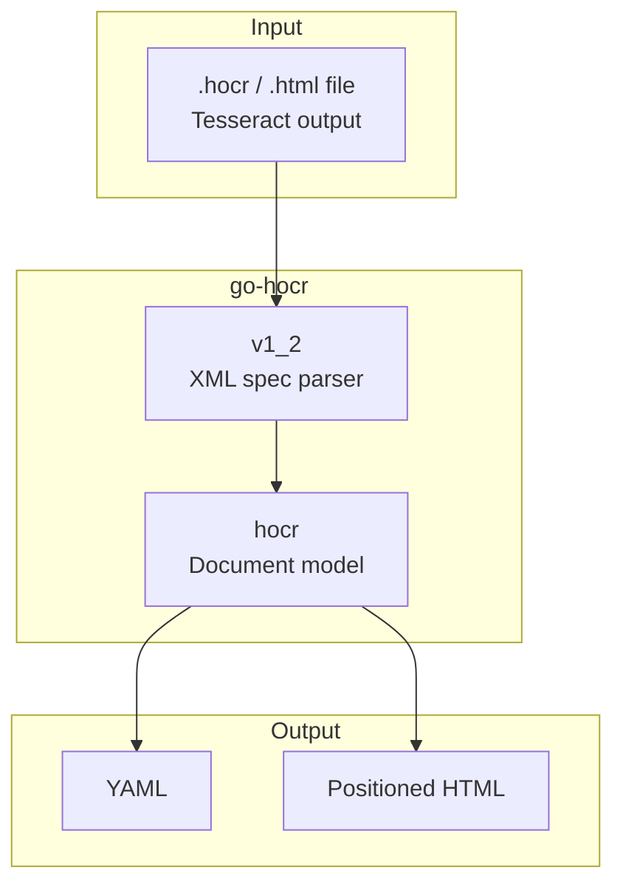

# go-hocr

[](https://pkg.go.dev/github.com/eslider/go-hocr)
[](https://opensource.org/licenses/MIT)
[](https://go.dev)
[](https://github.com/eSlider/go-hocr/releases)
[](https://github.com/eSlider/go-hocr/stargazers)

Go library for parsing, analysing, and exporting [hOCR](https://en.wikipedia.org/wiki/HOCR) files — the HTML-based OCR output format used by [Tesseract](https://github.com/tesseract-ocr/tesseract) and other OCR engines.

Extracted from [vidarr](https://git.produktor.io/produktor/vidarr) as a standalone library.

## Architecture



## Packages

| Package | Import | Description |
|---|---|---|
| `hocr` | `github.com/eslider/go-hocr` | hOCR 1.2 document model with YAML/HTML export |
| `v1_2` | `github.com/eslider/go-hocr/v1_2` | Low-level hOCR 1.2 XML types and property parsing |

---

## Installation

```bash
go get github.com/eslider/go-hocr@v0.2.0
```

**System dependency** (to produce hOCR files):

```bash
# Debian/Ubuntu
sudo apt-get install tesseract-ocr tesseract-ocr-deu tesseract-ocr-eng
```

Generate hOCR with Tesseract:

```bash
tesseract input.png output -l deu --oem 3 --dpi 600 --psm 1 hocr
# produces output.hocr
```

---

## Quick Start

### Parse hOCR 1.2 document

```go
import hocr "github.com/eslider/go-hocr"

doc, err := hocr.ReadFile("invoice.hocr")
if err != nil {
    log.Fatal(err)
}

fmt.Println("OCR system:", doc.System)
fmt.Println("Capabilities:", doc.Capabilities)

yaml, _ := doc.ToYaml()
fmt.Println(yaml)

html, _ := doc.ToHtml(1) // page 1
fmt.Println(html)
```

### Low-level spec access

```go
import (
    hocr "github.com/eslider/go-hocr"
    "github.com/eslider/go-hocr/v1_2"
)

data, _ := os.ReadFile("invoice.hocr")

var raw v1_2.Document
xml.Unmarshal(data, &raw)

doc := hocr.NewDocument(&raw)
```

---

## API Reference

### `hocr` — Document model

| Function / Method | Description |
|---|---|
| `ReadFile(path)` | Parse an hOCR file into a structured `Document` |
| `NewDocument(*v1_2.Document)` | Build document from raw spec types |
| `(*Document) ToYaml()` | Export document as YAML string |
| `(*Document) ToHtml(pageNr)` | Export positioned HTML for a page |
| `(*Page) GetHtml()` | Render page blocks as HTML |
| `(*Block) IsContentArea()` | Check if block is a content area |
| `(*Line) GetHtml()` | Render line with word positioning |

### `v1_2` — Spec parser

| Function / Method | Description |
|---|---|
| `(*Element) GetProperties()` | Parse and cache `title` attribute properties |
| `(*Element) GetBoundingBox()` | Parse `bbox x0 y0 x1 y1` |
| `(*Element) GetPropF32(key)` | Read float property (e.g. `x_wconf`) |
| `(*Document) GetCapabilities()` | Read `ocr-capabilities` meta |
| `(*Document) GetSystem()` | Read `ocr-system` meta |

---

## hOCR Specification

This library targets [hOCR 1.2](https://kba.github.io/hocr-spec/1.2/) as produced by Tesseract 4.x/5.x.

Supported element types:

- `ocr_page` — page with image reference and scan resolution
- `ocr_carea` — content area blocks
- `ocr_par` — paragraphs with language
- `ocr_line` — text lines with baseline and font metrics
- `ocrx_word` — words with bounding boxes and confidence (`x_wconf`)
- `ocr_separator` / `ocr_photo` — layout separators and images

---

## Related Libraries

| Library | Description | Install |
|---|---|---|
| [go-matrix-bot](https://github.com/eSlider/go-matrix-bot) | Matrix bot framework with AI integrations | `go get github.com/eslider/go-matrix-bot` |
| [go-ollama](https://github.com/eSlider/go-ollama) | Ollama/Open WebUI streaming client | `go get github.com/eslider/go-ollama` |

## License

[MIT](LICENSE)
